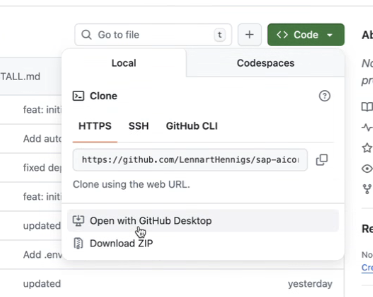

# Setting up dev tools

You need to install `node`, `npm`, `git`.
And I suggest to use `iTerm`, a nice Terminal program.

To start, open your Terminal `[CMD + Space] > Terminal`

## 1. Install Homebrew

Install Homebrew (Apple Silicon) and set up your shell environment

```shell
/bin/bash -c "$(curl -fsSL https://raw.githubusercontent.com/Homebrew/install/HEAD/install.sh)"
```

Add Homebrew to your PATH
(the installer will show the exact commands)

``` shell
follow the step shown by brew
```

## 2. Install GIT (if not already installed via macOS)

Install the GIT command line tool

```shell
brew install git
```

## 3. Download the repo and unpack it



Go to the place where you want to have the folder:

```shell
cd
cd Documents
```

## 4. Install Node.js

```shell
brew install node
brew upgrade node
```

Verify installations:

```shell
node -v
npm -v
git --version
```

## 5. Project Setup

Once you have the project folder, navigate to it and install dependencies:

```shell
cd sap-aicore-proxy
npm install
```

## 6. Configure Environment

You have two options for configuration:

### Option A: Manual configuration

```shell
cp .env.example .env
```

### Option A: Automatic configuration (if you have ai-core-key.json from SAP AI Core)

```shell
./scripts/generate-env.sh ai-core-key.json
```

Next, edit .env file with your SAP AI Core credentials

```env
# ------- Required Configurations -------

# SAP AI Core Authentication Configuration
AICORE_CLIENT_ID="your-client-id"
AICORE_CLIENT_SECRET="your-client-secret"
AICORE_AUTH_URL=https://your-auth.example.com
AICORE_BASE_URL=https://your-ai-api.example.com

# ------- Optional Configurations -------

# Server Configuration (Optional)
PORT=3001
HOST=localhost
TOKEN_EXPIRY_BUFFER=60
DEFAULT_TOKEN_EXPIRY=3600

# CORS Configuration (Optional)
CORS_ORIGIN=*

# Model Configuration (Optional)
DEFAULT_MODEL=gpt-5-nano
DEFAULT_MAX_TOKENS=1000

# Model Pool Configuration (Optional)
MODEL_POOL_MAX_IDLE_TIME=1800000
MODEL_POOL_CLEANUP_INTERVAL=300000

# Provider Configuration (Optional)
SAP_AICORE_PROVIDER_PREFIX=sap-aicore

# Body Size Limits (Optional)
BODY_LIMIT_JSON=50mb
BODY_LIMIT_URLENCODED=50mb
BODY_LIMIT_RAW=50mb

# API Endpoint Defaults (Optional)
ANTHROPIC_DEFAULT_VERSION=bedrock-2023-05-31
ANTHROPIC_DEFAULT_ENDPOINT=/invoke
GEMINI_DEFAULT_ENDPOINT=/models/gemini-2.5-flash:generateContent
GENERIC_DEFAULT_ENDPOINT=
```

**Important**:

- Client ID should be in double quotes
- Client secret should be in single quotes to handle special characters
- All server configuration is optional with sensible defaults
- **Configuration Validation**: The server validates all configurations on startup and reports any issues

## 7. Start the Server

Start the proxy server:

```shell
npm start
```

On first startup, the server will:
- **Generate a custom API key** in `sk-proj-*` format
- **Display the API key** in the console output
- **Save the API key** to `.env.apikey` file
- **Validate all configurations** and report any issues

**Important**: Save your API key from the console output or check the `.env.apikey` file - you'll need it to configure your AI clients.

## 8. Configure Your AI Client

Configure your OpenAI-compatible AI client with:

- **API Host**: `http://localhost:3001`
- **API Path**: `/v1`
- **API Key**: Your custom API key (from startup console or `.env.apikey`)
- **Model**: `gpt-5-nano`, `anthropic--claude-4-sonnet`, or `gemini-2.5-flash`

## 9. Test the Installation

Test your setup with a simple curl request:

```shell
# Replace YOUR_API_KEY with your actual API key from .env.apikey
curl -X POST http://localhost:3001/v1/chat/completions \
  -H "Content-Type: application/json" \
  -H "Authorization: Bearer YOUR_API_KEY" \
  -d '{
    "model": "gpt-5-nano",
    "messages": [{"role": "user", "content": "Hello!"}],
    "max_tokens": 50
  }'
```

Or check the health endpoint (no authentication required):

```shell
curl http://localhost:3001/health
```

## 10. Run Tests (Optional)

Verify your installation with the authentication test suite:

```shell
# Quick validation (recommended)
npm run test:auth:unit
npm run test:auth:flow

# Complete authentication test suite
npm run test:auth
```

## 11. Done

Your SAP AI Core Proxy is now ready! For more details, see:

- **[README.md](./README.md)** - Complete usage guide and features
- **[tests/AUTHENTICATION-TESTS.md](./tests/AUTHENTICATION-TESTS.md)** - Authentication system details
- **[CLAUDE.md](./CLAUDE.md)** - Technical implementation guide

### API Key Management

- **View API Key**: `cat .env.apikey`
- **Regenerate API Key**: `rm .env.apikey && npm start`
- **Backup API Key**: Save the key securely as it's required for all API requests

### Compatible AI Clients

Popular clients that work with this proxy:
- **[Open WebUI](https://docs.openwebui.com/)** - Web interface with document uploads
- **[Chatbox](https://chatboxai.app/)** - Cross-platform desktop client

### Updates – most likely not needed

```shell
npm install -g npm@latest
```

If you need to switch Node versions later, consider using a local tool other than nvm (e.g., Homebrew-managed Node, or a project-specific installer). This guide avoids nvm as requested.
